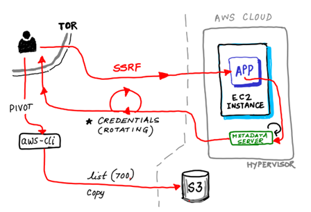

# Capital-One Breach Demo

<i> This is a repo designed to walk users through the infamous Capital-One breach, and exploitation of a vulnerable ec2 instance via the AWS IMDSv1 SSRF exploit.
The repo include the description of the breach and a terraform file to create the infrastructure in AWS to recreate the vulnerability </i>

## Objectives
- Review Capital-One breach and its implication.
- Discuss the AWS metadata service, and the role it plays.   
- What is Server Side Request Forgery (SSRF).  
- Deploy a vulnerable ec2 instance, and the methods to extract AWS access keys.  
- Enumerate permissions and exfiltrate data from the account.  
- Mitigation options and command to patch the vulnerable infrastructure.  

## Requirements

### Package Dependencies
- awscli
- terrform
- curl

### Environmental Dependencies
- AWS account
- AWS IAM role or user that can be used to deploy infrastructure and interact with the resources.
- iam_instance_profile with S3 access 
- S3 bucket with "secret" information.

## Important Contextual Information 

### A bit about a breach

**$80 million**  
This is the bottom line and the outcome of this breach.  
Capital One will pay an $80 million civil penalty for its role in a 2019 security breach that exposed the personal data of more than 100 million customers (reported by the Wall Street Journal).  
In July 2019, the bank disclosed that personal information including names and addresses of about 100 million individuals in the United States and 6 million people in Canada were obtained by a hacker.  
The problem stemmed in part from a misconfigured open-source Web Application Firewall (WAF) that Capital One was using as part of its operations hosted in the cloud with Amazon Web Services (AWS).  
The WAF services was used to cary with “Server Side Request Forgery” (SSRF) attack, that "tricked" the WAF to reveal credentials, allowing the hacker to gain access to S3 buckets containing sensitive information.

Illustration of the breach could be found below:

### What is the AWS instance metadata service?
The instance metadata service [(IMDS)](https://docs.aws.amazon.com/AWSEC2/latest/UserGuide/ec2-instance-metadata.html) is an API used by resources in AWS to access information about themselves. 
It can include data such as IDs, Network information or User data.  
Critically however, it is the mechanism that ec2 instances use to retrieve credentials related to their instance profile - which affect what API actions they are authorized to carry out. There are two versions of the IMDS API, v1 and v2.
The metadata could be access with a GET request, sent to reserved and internal IP address, e.g http://169.254.169.254/latest/meta-data/

### What is SSRF?
SSRF, or Server Side Request Forgery, is a member of the OWASP top 10; and one of the most common web exploit families.  Essentially, it involves making a request that tricks a web server into making a HTTP request and returning the result to the attacker.  As it is the web server making the request, the attacker has the ability to access information that they otherwise would not have access to.

### OK, So what? the cloud is secured!
As you may have guessed, where SSRF vulnerabilities are present in an application, the IMDSv1 service can be vulnerable to Server Side Request Forgery attacks.  This attack vector can be used to steal AWS credentials, which in turn can be used to access the privileges that the vulnerable ec2 instance had access to.

## How to mitigate this risk?
- **Enable IMDSv2 Service**  
Users can choose to restrict ec2 instances to only use the IMDSv2 service, which applies an appropriate mitigation to this vulnerability via a Token methodology. 
The new Instance Metadata Service v2 (IMDSv2) tackles unauthenticated GET requests conditions.
A requirement of a HTTP header called `x-aws-ec2-metadata-token` that contains a value generated via a PUT request to http://169.254.169.254/latest/api/token
A PUT request to http://169.254.169.254/latest/api/token with the custom header `x-aws-ec2-metadata-token-ttl-seconds` with the value of the number of seconds for which the token needs to be active. 
This PUT request generates the token to be used for fetching the metadata information.
For a SSRF to succeed with this update, the attacker would need to be able to control the HTTP Method (force server to make a PUT instead of the standard GET) and be able to pass custom headers to the server, which the server then will use to make the requests.

- **Secure Web Development Practices**  
  Embracing good secure coding practices such as never trusting user input will reduce the risk of being vulnerable to these types of vulnerabilities.
  This will required further input validation or limit the GET request URLs.

- **Least Privilege Principles**  
  When you set permissions with IAM policies, grant only the permissions required to perform a task. 
  You do this by defining the actions that can be taken on specific resources under specific conditions, also known as least-privilege permissions. 
  You might start with broad permissions while you explore the permissions that are required for your workload or use case. 
  As your use case matures, you can work to reduce the permissions that you grant to work toward least privilege.
  Follow other AWS IAM [best practice](https://docs.aws.amazon.com/IAM/latest/UserGuide/best-practices.html)  
  Although this will not completely mitigate this exploit, ensuring that IAM policies are designed with least privilege principles in mind will lower an attackers ability to move laterally in the event that an ec2 instance is compromised.

## Let's GO - execute the demo
With the help of a predefined web server, it is possible to run the SSRF attack.
Credit to [SethSec](https://github.com/sethsec) for the [vulnerable application](https://github.com/sethsec/Nodejs-SSRF-App)
You can start the implementing the demo environment following the [demo instructions](Demo-instructions/README.md)